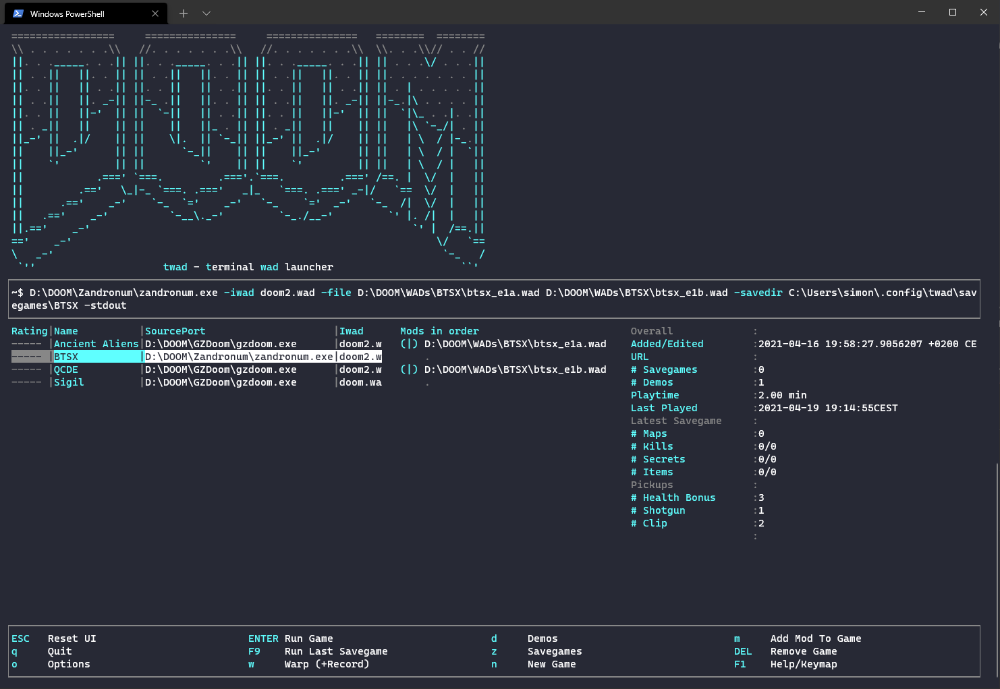
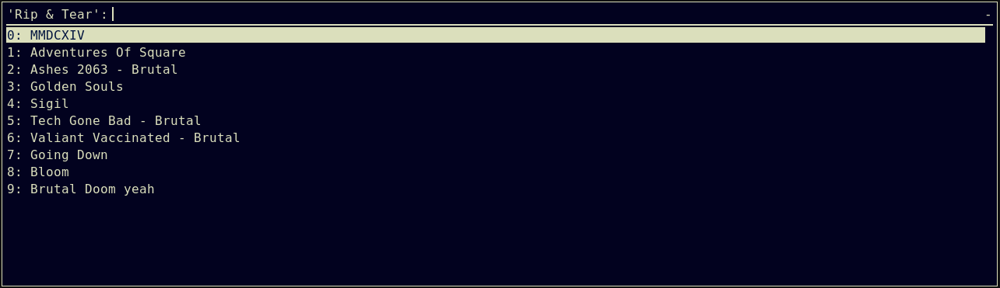

# twad - terminal wad launcher

If you love classic __DOOM__ and want to manage modern source ports to play it along with the plethora of maps, skins and gameplay mods then **twad** is for you. At it's core **twad** lets you set up a multitude of WAD file combinations, store and launch them with a couple of key strokes. It is light weight and fast to use. If your are living in the termninal you'll feel right at home. Though, even if you are on Windows, double-click and get an intuitive, simplistic and fast retro style user interface to manage your ripping and tearing.

## Start **classic DOOM** with a **classic** retro style terminal user interface

Twad let's you stay in the terminal and on your keyboard as long as possible until you decide to **rip and tear**. Simple as that. Needless to say that this mostly was designed for *nix systems. However, meanwhile I've added some OS-sensitive behaviour and cross compiled for Windows. Actually it works quite well. So...

## Now with experimental **Windows support**

**Watch Out**: This tool is still in early state and might contain bugs.




# Features

* Configure *games* you want to play (basically a combination of IWAD, Source Port and Mod Files)
* Run games
* Quickload (start from latest savegame)
* Warp to specific episodes / levels
* Record demos
* Watch demos
* Delete demos
* Collect some stats from the cames console output as well as playtime and so on (not sending it anywhere)
* Collect stats from savegames
* Run games from rofi or dmenu
* Import .zip files containing mods
* Separate savegame / demo folders for games (in **~/.config/twad/...***)
* Separate configs per game and shared configs per source port
* IDGames search/browser and download
* Responsive layout (kind of)

# Installation Options

## a) Arch Linux: AUR

https://aur.archlinux.org/packages/twad-git

## b) Binary Download

I'll add precompiled binaries to the [releases page](https://github.com/zmnpl/twad/releases). It comes without dependencies, just **download and run it**.

## c) Compile yourself

```golang
go get -u github.com/zmnpl/twad
```

## d) Windows

* Download the .exe from the [releases page](https://github.com/zmnpl/twad/releases)
* Doubleclick

# Setup your environment

***twad*** assumes, you have **one folder**, where your IWADs are located. All your pwads (mapsets, gameplay mods, ...) need to be in the same or subfolder of this. The folder, where you put your IWADs is known to source ports as **DOOMWADDIR**.

1) Setup your **DOOMWADDIR** as described above
2) twad's first start will ask you to configure your **DOOMWADDIR** in the options
3) Within twad create games
4) Add mods to your games
666)   __Rip and Tear__

## An example could look like this
```bash
~/DOOM ❯❯❯ tree
.
├── Ashes 2063
│   ├── Ashes2063Maps115.wad
│   └── Ashes2063Mod115.pk3
├── Back To Saturn X e1
│   ├── btsx_e1a.wad
│   ├── btsx_e1b.wad
│   └── btsx_e1.deh
├── D4T
│   └── D4Tv2.5.pk3
├── Sigil
│   ├── SIGIL_COMPAT.wad
│   └── SIGIL.wad
├── doom2.wad
└── doom.wad
```

## Or this on Windows
```cmd
C:\DOOM\> dir
.
├── Ashes 2063
│   ├── Ashes2063Maps115.wad
│   └── Ashes2063Mod115.pk3
├── Back To Saturn X e1
│   ├── btsx_e1a.wad
│   ├── btsx_e1b.wad
│   └── btsx_e1.deh
├── D4T
│   └── D4Tv2.5.pk3
├── Sigil
│   ├── SIGIL_COMPAT.wad
│   └── SIGIL.wad
├── doom2.wad
└── doom.wad
```


## More on DOOMWADDIR

Your DOOM source port needs to know about the base folder of your mods and IWADs to work properly, since ***twad*** uses relative paths. ***twad***'s default method for this is to set the ***DOOMWADDIR*** environment variable when starting a game. This is only set for the current game session. (Should you already have set DOOMWADDIR, twad will shadow it with whatever is set in its configuration)

An alternative/additional method is to add paths to the respective source ports config. For *zdoom* ports it could look like this:
```bash
# in your doom engine .ini
[FileSearch.Directories]
PATH=/home/doomguy/DOOM # path to DOOMWADDIR
```

# Rofi Mode

You can use [***rofi***](https://github.com/davatorium/rofi) or [***dmenu***](https://tools.suckless.org/dmenu/) to launch your games. Run twad like this to use the respective programm. This will open rofi/dmenu and show a list of all games you already have. Select one you want to play and hit enter. Of course this will also track your statistics.
```bash
twad --rofi
# or
twad --dmenu
```
**For instant Rip & Tear** bind this to a keyboard shortcut




# Plans / Ideas

- ~~Separate savegames folders per game~~
- ~~AUR package~~
- ~~Rofi mode~~
- ~~Help area~~
- ~~Savegame Count~~
- ~~Unified Add/Edit dialog~~
- ~~Opions scren~~
- ~~Ability to hide the header for screens with few rows~~
- ~~Add button for path setup~~
- ~~Quickload~~
- ~~Warp to map~~
- ~~Demo recording / viewing~~
- ~~More statistics; Parse from savegames~~
- ~~Zip-Import~~
- ~~WSL support~~ Windows support
- ~~idgames download~~ + autoinstall
- wad archive download + autoinstall
- All the TODO flags
- Error Handling
- Metadata scraping(?)
- Tagging / Searching / Filtering


# Credit where credit is due

## All the other Doom launchers
There are already great alternatives to manage and launch your WADs out there for many years and I give credits to all of them since I've taken a lot of inspiration and knowledge on their functionality. Especially [Doomlauncher](https://github.com/nstlaurent/DoomLauncher) is a cool piece of software and the source code is well structured and good to read which helped me quite a lot.

## Doom logo

The use of the DOOM ASCII logo has been nicely permitted by Frans P. de Vries. Find it's history [here](http://www.gamers.org/~fpv/doomlogo.html)

DOOM and Quake are registered trademarks of id Software, Inc. The DOOM, Quake and id logos are trademarks of id Software, Inc. The ASCII version of the DOOM logo is Copyright © 1994 by F.P. de Vries.

## tview

[tview](https://github.com/rivo/tview) is used for the terminal ui elements.
